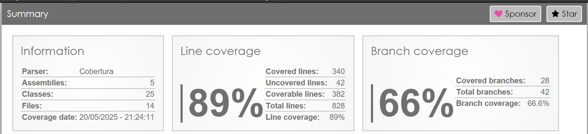
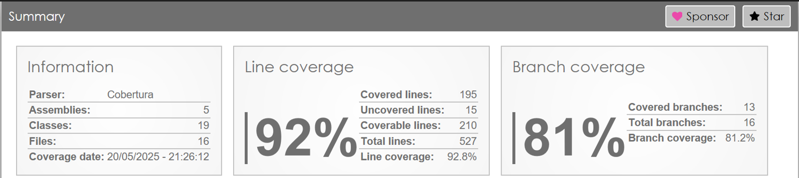
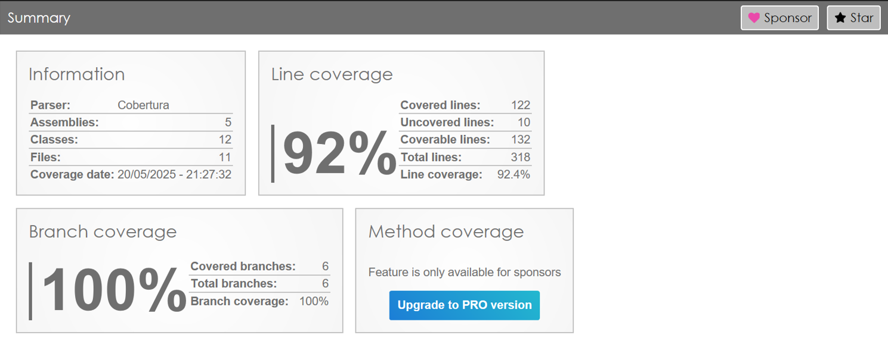
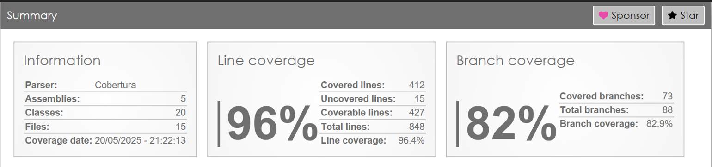

# ☸️ Infraestrutura Kubernetes com Terraform

Este repositório faz parte do **sistema distribuído de controle de pedidos** e contém a estrutura do **Kubernetes**, gerenciada via **Terraform**, responsável por provisionar e manter o cluster que sustenta toda a arquitetura dos microserviços do sistema.

Além disso, inclui a configuração do banco de dados **MySQL RDS**, utilizado pelo microserviço de gerenciamento.

## 📌 Funcionalidades

- Provisionar e gerenciar o cluster Kubernetes que orquestra os microserviços do sistema.
- Criar e manter as instâncias **MongoDB** utilizadas pelos microserviços.

---

## 🧱 Arquitetura

Este projeto faz parte de um sistema de **microsserviços**, divididos da seguinte forma:

| Microsserviço&nbsp;&nbsp;&nbsp;&nbsp;   | Descrição                                | Repositório | Cobertura de Testes |
|-----------------|--------------------------------------------|-------------|----------------------|
| 🍽️ Pedidos     | Gerenciamento de pedidos dos clientes     | [https://github.com/guilhermesd/servicopedidos](https://github.com/guilhermesd/servicopedidos) |  |
| 🧾 Pagamentos  | Processamento de pagamentos e faturas     | [https://github.com/guilhermesd/servicopagamentos](https://github.com/guilhermesd/servicopagamentos) |  |
| 👨‍🍳 Produção    | Controle de produção e estoque            | [https://github.com/guilhermesd/servicoproducao](https://github.com/guilhermesd/servicoproducao) |  |
| 🛠️ Gerenciador    | Cadastro e manutenção de clientes e produtos        | [https://github.com/guilhermesd/controlepedidos](https://github.com/guilhermesd/controlepedidos) |  |

## 🧩 Infraestrutura do Sistema

 Este projeto faz parte dos projetos de infraestrutura responsáveis por autenticação, banco de dados e orquestração via Kubernetes. Todos os recursos são provisionados utilizando **Terraform**:

| Repositório                                                                 | Descrição                                                                                                         |
|------------------------------------------------------------------------------|-------------------------------------------------------------------------------------------------------------------|
| 🔐 [pedidos-api-gateway-lambda](https://github.com/guilhermesd/pedidos-api-gateway-lambda) | Projeto Terraform que provisiona o API Gateway e uma função AWS Lambda para autenticação de clientes.            |
| 🗄️ [controlepedidosdb](https://github.com/guilhermesd/controlepedidosdb)                       | Projeto Terraform responsável por criar e gerenciar o banco de dados MySQL RDS usado pelo microsserviço de gerenciamento. |
| ☸️ [controlepedidosK8s](https://github.com/guilhermesd/controlepedidosK8s)                    | Projeto Terraform responsável pela infraestrutura de orquestração dos microsserviços com Kubernetes.             |

---

## ⚙️ Tecnologias Utilizadas

- Kubernetes
- Terraform 
